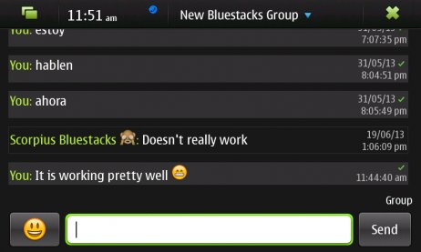
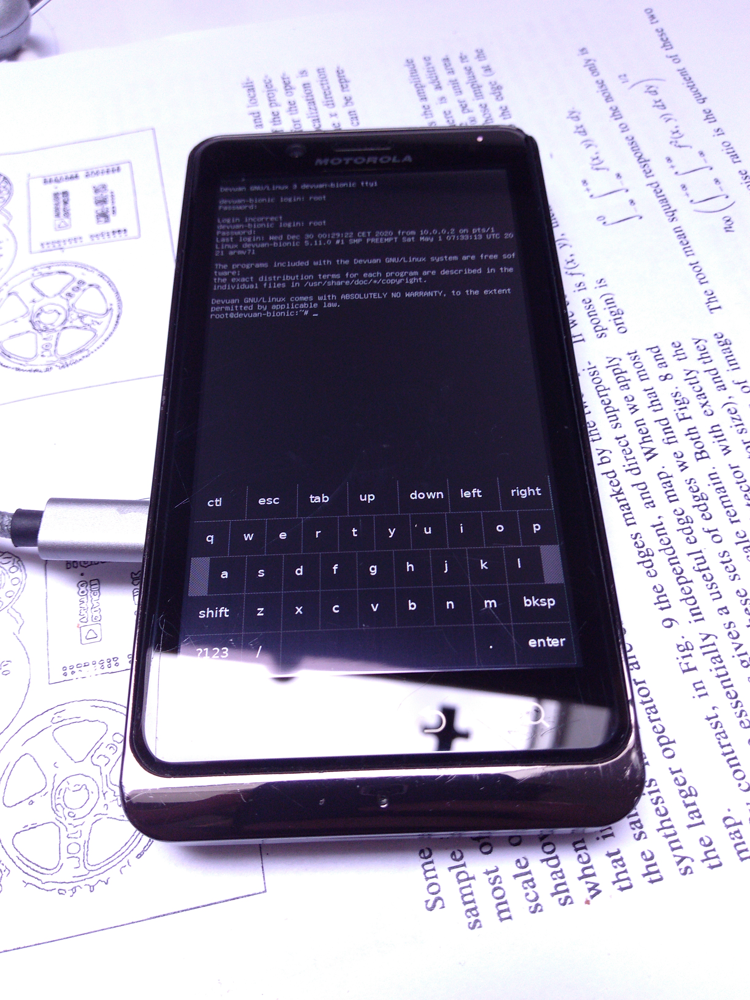
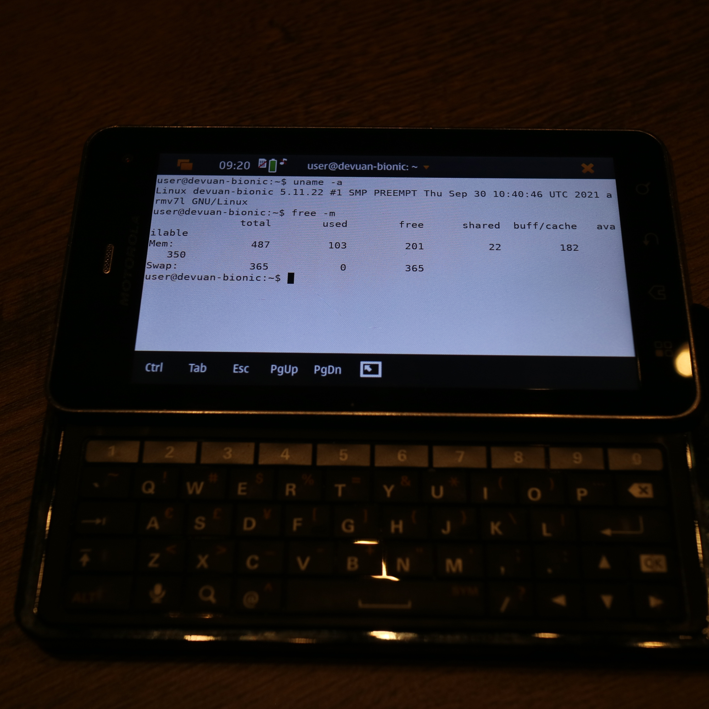

Maemo Leste - Fifteenth Update: Januari - October 2021
######################################################

:Category: news
:tags: todo
:authors: Merlijn Wajer, Ivan Jelincic
:date: 2021-10-28 00:00

The long overdue update is finally here, it's been a while since our `last
update
<{filename}/maemo-leste-update-december-2020.rst>`_.

Here are a few highlights:

* `sphone`_ call interface;
* `modest`_ (mail client);
* `GPS interfaces`_;
* support for `Tor, Wireguard and OpenVPN`_;
* many `mce`_ improvements;
* `Funding update`_;
* `Motorola Droid 3 (XT862)`_ port;
* `Audio support`_ progress;
* `address book`_ progress;
* our plan for sms and `conversations`_;

Funding update
==============

Since our `NGI funding announcement <{filename}/ngi-funding-april-2021.rst>`_
we've been working hard on finishing the milestones as proposed. The `Tor,
Wireguard and OpenVPN`_ integration is finished and available in the extras
repositories.

Following the successful completion of this milestone, the
`DAPSI <https://dapsi.ngi.eu>`_ project has let us know that Maemo Leste has
successfully moved into the second phase of the funding!

This is great news, and means that we will hopefully be able to deliver on the
next milestones of the funding soon, including:

* "Conversations" UI, using Telepathy to support various protocols (SMS, IRC,
  XMPP, Matrix, GNU Jami aka ring, Signal)
* Implementation of some of the above protocols in Telepathy
* Improve the Maemo sharing libraries

Core Software additions and changes
===================================

There were lots of improvements in the networking stack, as well as to many of
the core daemons, this section aims to give a comprehensive overview of all the
changes.

modest
------

modest, the Maemo mail client `has been brought to Maemo Leste <https://github.com/maemo-leste/bugtracker/issues/207>`_.
It relies on `tinymail <https://github.com/maemo-leste/tinymail>`_ and `gtkhtml3
<https://github.com/maemo-leste/gtkhtml3>`_.

We will later on port modest to a
newer HTML rendering framework.

.. image:: /images/modest-1.jpg
  :height: 324px
  :width: 576px

.. image:: /images/modest-2.jpg
  :height: 324px
  :width: 576px

GPS interfaces
--------------

We've been continuing our work on the GPS stack and liblocation, packaging
various GPS interfaces and fixings bugs as we find them.

Currently, there are at least four interfaces in our repositories, they've also
gotten their own pages on the wiki:

* https://leste.maemo.org/Extras/modrana (more info: https://wiki.maemo.org/ModRana)
* https://leste.maemo.org/Extras/maep
* https://leste.maemo.org/Extras/cloudgps
* https://leste.maemo.org/Extras/gpsrecorder

Exporting the GPS logs from gpsrecorder or maep also works fine, as we have
shared in `this cycling tweet
<https://twitter.com/maemoleste/status/1389277775664721923>`_.

Tor, Wireguard and OpenVPN
--------------------------

Tor
~~~

Tor `The Onion Router <https://www.torproject.org/>`_ is software that provides
anonymous communication (over the Internet). We've integrated it in Maemo
Leste's connectivity framework and user interface.

There is a `Tor wiki page <https://leste.maemo.org/Tor>`_ with more screenshots
and some examples on how to use it. Most of the source code is in the
`libicd-tor <https://github.com/maemo-leste/libicd-tor>`_ repository.

Probably the most simple way to use this code is to install it from the package
manager, restart the device and configuring Tor to "Enable Transparent
proxying", which will cause all the traffic of the device to be transmitted over
Tor. The screenshot below shows a Droid 4 with Tor with transparent proxying
enabled.

.. image:: /images/tor-check.png
  :height: 324px
  :width: 576px

Wireguard
~~~~~~~~~

Wireguard is a relatively new and simple communication protocol that implements
an encrypted Virtual Private Network (VPN). There are many use cases, but a few
examples are adding your phone to a Wireguard network that makes it possible to
access your LAN from wherever you are, give your device a public IPv4 address,
or otherwise tunnel traffic via another machine.

There is a `Wireguard wiki page <https://leste.maemo.org/Wireguard>`_ with more screenshots
and some examples on how to use it. Most of the source code is in the
`libicd-wireguard <https://github.com/maemo-leste/libicd-wireguard>`_ repository.

The screenshow below shows a Droid 4 with Wireguard enabled over wifi, and some
interface statistics using ``wg show``.

.. image:: /images/wg-show.png
  :height: 324px
  :width: 576px

OpenVPN
~~~~~~~

TODO

* https://github.com/maemo-leste/libicd-openvpn

connui providers
~~~~~~~~~~~~~~~~

Maemo Fremantle supported a feature that wasn't really used much, which were the
`ICD2 service providers
<http://maemo.org/api_refs/5.0/5.0-final/icd2/group__icd__srv__provider.html>`_,
which are a way to add connection "plugins" to specific connections. The example
provided was a plugin to disable network logon pages and (automatically) deal
with those. We have extended this ICD2 implementation to support Tor, Wireguard
and OpenVPN.

Since there wasn't too much documentation how this integrated with the rest of
the system, we developed `libicd-provider-dummy
<https://github.com/maemo-leste/libicd-provider-dummy/>`_ to explore how the
rest of the system interacts with service providers. For example, service
providers can change the icon of the network in the status area, they can add
additional icons in the connection dialogs and network status, and also provide
customisation of the network names.

The code written to support providers in the connui interfaces can
be found here in this `connui-internet pull request
<https://github.com/maemo-leste/connui-internet/pull/2/>`_ and this
`connui-common pull request
<https://github.com/maemo-leste/connui-common/pull/1>`_.

Below is an example of an IAP being configured to use Wireguard service
provider - this means it will always connect to Wireguard when connecting to the
IAP, and if connecting to Wireguard fails, the network connection will be
severed.

.. image:: /images/wireguard-provider.png
  :height: 324px
  :width: 576px

.. image:: /images/wireguard-provider-cfg.png
  :height: 324px
  :width: 576px

resolvconf
~~~~~~~~~~

Due to the way `wg-quick` from the Wireguard tools worked, we also had to
overhaul our DNS scripts. We initially imported them from Maemo Leste, but
recently upgraded them to use `resolvconf
<https://github.com/maemo-leste/libicd-network-ipv4/pull/3>`_ (issue `#583
<https://github.com/maemo-leste/bugtracker/issues/583>`_), making our setup more
robust.

connui
------

Previously, the connection dialogs on Maemo Leste would malfunction if they
invoked programmatically (`#539
<https://github.com/maemo-leste/bugtracker/issues/539>`_), this problem has been
solved now.

mce
---

**uvos** has been consistently working on improving `mce` and a lot has changed:

* mce uses less memory (about 400kB) by using link time optimisations (LTO),
  `--dynamic-list` and a build system rewrite (`from plain Makefile to cmake
  <https://github.com/maemo-leste/mce/pull/50>`_).
  LTO is not in use on Leste yet, as it still causes some problems with upower
  and tklock.
* Proximity sensor module based on the `iio system <https://github.com/maemo-leste/mce/pull/17>`_
* Legacy display module is `dropped
  <https://github.com/maemo-leste/mce/pull/48>`_
* The `alarm` module is now loaded (`PR #46 <https://github.com/maemo-leste/mce/pull/46>`_)
* `rtconf <https://github.com/maemo-leste/mce/pull/49>`_ support has been added,
  allowing for using different backends, to make it easier to drop gconf
  support. Alternative backend types are `ini` files and `gsettings`.
* `battery-guard <https://github.com/maemo-leste/mce/pull/43>`_ module was added
* `power-generic <https://github.com/maemo-leste/mce/pull/47>`_ module that
  allows mce to operate in absence of dsme.

Additionally, mce now supports some more dbus interfaces for changing various
settings, which were previously changed through gconf directly, which made for
some awkward architecture:

* https://github.com/maemo-leste/profiled/pull/2
* https://github.com/maemo-leste/osso-applet-display/pull/1
* https://github.com/maemo-leste-extras/simple-brightness-applet/pull/2

Profiles control panel applet
-----------------------------

TODO

Some fixes, renamed
https://github.com/maemo-leste/bugtracker/issues/569

Wireless
--------

`Hidden access points are now supported <https://github.com/maemo-leste/bugtracker/issues/489>`_ in what turned out to be long and painful process of debugging problems in `connui-internet <https://github.com/maemo-leste/connui-internet/commit/181b42acf295ca32812ad6330e36c556d90cb3cb>`_, `wpasupplicant <https://github.com/maemo-leste/bugtracker/issues/489#issuecomment-881039662>`_ itself and the `N900 linux kernel <https://github.com/maemo-leste/n9xx-linux/commit/a242bd68f75cf9d68935aaa6f32fa05f3e4d62e9>`_.

The network scanning dialog would sometimes render scanning results with a
(long) delay, this is now fixed (issue `#342 <https://github.com/maemo-leste/bugtracker/issues/342>`_).

hildon-input-method
-------------------

hildon-input-method recently got some improvements where it can insert
characters into windows that do not explicitly support hildon input method (like
gtk2). The virtual keyboard can be summoned using dbus and can insert (currently
only) english characters into plain X11 windows. See the video below showing how
it works in Firefox (the touch screen button is used to summon the virtual
keyboard).

.. raw:: html

    <video controls height="480px" width="640px">
    <source src="images/him-dbus.webm" type="video/webm">
    </video>

In the future, we plan to use the `at-spi
<https://www.freedesktop.org/wiki/Accessibility/AT-SPI2/>`_ accessibility
interface to make the hildon-input-method integration more complete and
universal.

hildon-desktop
--------------

Since our last update, hildon-desktop has supported rotating the devices screen
(and adjust the touch input accordingly to match the screen orientation). With
this update, we've improved how that is implemented exactly to make it more
robust. For example, upon certain updates the touch input would reset to the
native orientation, which could be quite confusing. All of this is solved now by
making this work directly in hildon-desktop, rather than other scripts that act
on dbus signals.

Maemo also sets more ``XDG_*`` environment variables now to ensure that Hildon
applications behave properly, and show the right directories, see `issue #426 <https://github.com/maemo-leste/bugtracker/issues/426>`_.

In some rare cases, hildon-desktop would not boot if the battery is very low,
this is fixed now, see `issue #435 <https://github.com/maemo-leste/bugtracker/issues/435>`_.

osso-xterm
----------

osso-xterm now opens links in the default browser, and the volume keys should
`change the font size on the Droid 4 and similar devices <https://github.com/maemo-leste/bugtracker/issues/385>`_.

Audio support
-------------

Maemo Leste has supported basic audio output since the very first release, but
one of the many tricky parts of a mobile operating system is the audio routing.
For example, when one receives an incoming phone call, any music that is playing
should stop, and the ringtone sound should be heard. When a headphone is plugged
in during a call, one would expect the audio to switch from earpiece to
headphone, but, when a mediaplayer is playing music, unplugging the headphones
should perhaps not necessarily lead to music being played on the speakers, as
one might disturb others - so different outputs need their own volume control,
which needs to be saved somewhere, and so forth.

Many of these problems were solved in Maemo Fremantle, and much of that work
made it into Sailfish OS (Mer Project), so we've gone full circle and have
started packaging their work for Maemo. Here is a non-exhaustive list of
packages that we have ported and packaged:

* https://github.com/maemo-leste/ohm
* https://github.com/maemo-leste/libdres-ohm
* https://github.com/maemo-leste/libtrace-ohm
* https://github.com/maemo-leste/ohm-plugins-misc
* https://github.com/maemo-leste/pulse-core
* https://github.com/maemo-leste/pulseaudio-policy-enforcement
* https://github.com/maemo-leste/pulseaudio-modules-nemo
* https://github.com/maemo-leste/pulseaudio-module-cmtspeech-n9xx

These modules should help us with the audio policy routing, but also contain
device-specific support modules, for example in the case of the N900, where the
packages should help routing audio to and from the modem during phone calls.

More work remains to be done to integrate this on our devices, since audio
policies are somewhat complex and many of the components aren't well known to
us.

sphone
------

`sphone is a ofono GUI <https://github.com/maemo-leste/sphone>`_ based on gtk,
which `uvos` has been modernising and improving a bunch, aiming to make it
modular with optional hildon/maemo support. In other words: it's a program that
allows you to make phone calls on Maemo Leste, at least theoretically.

The integration in Maemo Leste is still very much a work in progress, as is
sphone, but it's already working to some degree, as can be seen in this video:

.. raw:: html

    <video controls height="360px" width="640px">
    <source src="/images/maemo-leste-sphone.webm" type="video/webm">
    </video>

Integration with the Maemo address book (and other address books) is also being
worked on. Here's a screenshot of the interface is portrait mode:

.. image:: /images/sphone-dialer.png
  :height: 576px
  :width: 324px

The application is only available in the **-devel** repositories.

address book
------------

We're still working on fully implementing the Maemo Fremantle address book and
contacts framework (osso-abook), but we've made a lot of progress - it should be
ready pretty soon.

.. image:: images/osso-abook-newcontact.png
  :height: 281px
  :width: 484px

conversations
-------------

There is not a lot to report on this subject yet, besides what was mentioned in
the `Funding update`_.

We aim to have the Conversations UI be a frontend for many Telepathy protocols
(SMS just being one of them), using the existing (Maemo Fremantle) rtcom (Real
Time Communication) framework. The widget set that we will use will likely be
Qt, and we will likely using an existing Maemo application and strip out
everything we don't need, and then add the parts we want.

In concrete steps:

1. Strip `yappari <https://github.com/agamez/yappari>`_ of all Whatsapp code, and
   re-use the GUI as conversations UI frontend - a lot will change, but the
   general UI is pretty usable;
2. Add support for `RTCOM
   <https://wiki.maemo.org/Documentation/Maemo_5_Developer_Guide/Architecture/RTCOM>`_
   using `rtcom-eventlogger
   <http://maemo.org/api_refs/5.0/5.0-final/eventlogger/>`_ and other plugins
   that might be required;
3. Add a simple telepathy plugin (telepathy-ring for sms most likely);
4. Modify the UI to support multiple protocols the way we want to;
5. Look into user interfaces to modify telepathy protocol parameters;
6. Add more telepathy protocols;

Below is a low-resolution screenshot of what Yappari looks like on Maemo
Fremantle - **it is not a screenshot of our current conversations application**.

recovery boot option
--------------------

We now feature a recovery boot option for various devices, see `issue #505
<https://github.com/maemo-leste/bugtracker/issues/505>`_ and `image-builder pull
request 8 <https://github.com/maemo-leste/image-builder/pull/8>`_. This is not
yet available for the Pinephone and N900, but it is for the Droid 3, Droid 4
and Droid Bionic.

fbkeyboard
----------

The Maemo Leste emergency rescue boot mode now features a framebuffer
keyboard, our modified version of it `can be found in the fbkeyboard repository
<https://github.com/maemo-leste/fbkeyboard>`_.

fbkeyboard is not available when the device has a hardware keyboard.

osso-systemui-devlock
---------------------

If your Nokia N900 had a lock code set, Maemo Leste would get stuck somewhere
during booting with a black screen. This has now been solved, see `issue #495
<https://github.com/maemo-leste/bugtracker/issues/495>`_ and `issue #343
<https://github.com/maemo-leste/bugtracker/issues/343>`_.

Additional Software changes
===========================

libsdl input
------------

The libsdl video and input problems we were seeing before have finally been fixed, see `issue #413 <https://github.com/maemo-leste/bugtracker/issues/413>`_.
This is great since it also makes many other applications more usable, for
example `cloudgps` . So the (full screen) window placement should now work fine,
and both keyboard and mouse input should just work.

Python bindings
---------------

We have added python bindings for `libconic`, the hildon connection management
library, see `python-conic <https://github.com/maemo-leste/python-conic>`_.

ScummVM
-------

ScummVM was broken since our migration to Devuan Beowulf, but rebasing on a
newer released fixed the problem, and now `ScummVM works again <https://github.com/maemo-leste/bugtracker/issues/353>`_.

There is also a ScummVM wiki entry now, with various tips and tricks:
https://leste.maemo.org/Extras/ScummVM

New Extras packages
-------------------

- new extras:
	- wifi-switcher
	- qshot
	- modrana https://leste.maemo.org/Extras/modrana
	- cloudgps https://leste.maemo.org/Extras/cloudgps
	- maep https://leste.maemo.org/Extras/maep
	- gpsrecorder: https://leste.maemo.org/Extras/gpsrecorder
	- braek https://leste.maemo.org/Extras/braek

Community updates
=================

Wiki updates
------------

todo: call for help on adding wiki pages for each extras package

* Extras pages, package infobox

* Device infobox

* wiki updates, Package infobox, https://leste.maemo.org/Extras/ScummVM
  https://leste.maemo.org/index.php?title=Template:Infobox_Package&action=edit

Languages and Translations
--------------------------

We have imported additional community translations:

* Arabic
* Turkish
* Slovak
* Hungarian

And we have drastically changed how we get translations to the Maemo Leste
devices - we now use the awesome `weblate.org` translation interface, making it
easy to change or submit translations, automatically creating Github pull
requests in the process.

Check out `Maemo Leste on Weblate.org
<https://hosted.weblate.org/projects/maemo-leste/#information>`_.

Leste on Android via chroot
---------------------------

- android chroot
  https://github.com/diejuse/chroot_Maemo-leste_on_Android
  https://www.youtube.com/watch?v=OqFHivcPIRM
  https://www.youtube.com/watch?v=kipuT0VXzC4

Hardware & Drivers
==================

Motorola Droid 3 (XT862)
------------------------

This is a new device port (codename ``solana``) - it's still in the early
stages, but a lot of things already just work, enough for us to boast about it:

* Support for kexecboot using `clown-boot`_
* X11 and 3D
* Audio
* Wireless
 
The following still needs work:

* Brightness control does not work - the screen always has maximum brightness
* Keyboard backlight doesn't seem to work yet
* The modem doesn't work yet - it shows up on USB, but the interrupts aren't configured properly.
* 3D shows some frame lag / misdrawing, perhaps the powervr clock needs adjusting
* Touchscreen buttons do not work yet (the ones on the side)
* Persistent kernel log store (pstore) does not work yet
* We might be able to free up 3MB more - we need to see if we can use 512MB ram instead of 509MB
* The keyboard layout in Leste is not faithful to the icons on the keyboard, but rather mostly mimic droid 4

More information on the `Droid 3 wiki page <https://leste.maemo.org/Motorola_Droid_3>`_.

clown-boot
~~~~~~~~~~

``clown-boot`` is the name for a method devised by **uvos** that uses a
double-kexec approach to load the kexecboot bootloader, and then the Maemo Leste
linux kernel. It was initially created for the Bionic device, but we've re-used
the approach for the Motorola Droid 3. We've decided to clean up the code a bit
and distributed it over three different repositories for reproducibility:

* Kernel modules for the Android stock kernel: https://github.com/maemo-leste/clown-boot-kexec
* Mainline-based kernel that is loaded from Android and loads kexecboot: https://github.com/maemo-leste/clown-boot-kernel
* Code used to kexec to kexecboot on Android: https://github.com/maemo-leste/clown-boot

The older code for clown-boot on the Droid 3 `can be found here
<https://github.com/MerlijnWajer/bionic-clown-boot/tree/solana>`_.

Motorola Droid 4
----------------

The Motorola Droid 4 should have significantly better power management, due to a
``quircks-mapphone`` module introduced in MCE, which will deal with silencing
the modem signal strength updates when the display is off and also deal with a
(current) power management problem in the modem usb interface that keeps the
modem awake even when there is no data to read. See `this commit
<https://github.com/maemo-leste/mce/commit/f25e8f20562a358d3df37c14e5d7b8639ec869c8>`_
for the code, and `this leste-config pull request
<https://github.com/maemo-leste/leste-config/pull/25/commits/b01dccd4ffb5e34dda058e231dcf64ee0712b7bb>`_
for the addition of the module.

The touch screen buttons now provide specific features:

* The **search** button raises the virtual keyboard, regardless of the
  application (see `hildon-input-method`_ improvements)
* The **back** button will either close a window or go back a stacked window
* The **home** window will switch to either the window expose view, or the
  application launcher view
* The **hamburger** button (three lines) will activate the hildon-specific
  context menu of applications if they support it

.. raw:: html

    <video controls height="480px" width="640px">
    <source src="images/ts-buttons-demonstration.webm" type="video/webm">
    </video>

Some of these features are also added to the pinephone hardware buttons.

TODO: headphone plug detection?

Nokia N900
----------

As mentioned in `osso-systemui-devlock`_, unlocking devices at boot should now
work. We are now also using the `nl80211` interface, as opposed to the `wext`
interface.

Pinephone
---------

## pinephone (maybe pinetab)
- hildon keyboard via shortcuts (vol up) (missing on n900)

## f1
- the port
- we need someone with this device to maintain it!

Interested?
===========

If you have questions, are interested in specifics, or helping out, or wish to
have a specific package ported, please see our bugtracker.

**We have several Nokia N900 and Motorola Droid 4 and Bionic units available to
interested developers**, so if you are interested in helping out but have
trouble acquiring a device, let us know.

Please also join our `mailing list
<https://mailinglists.dyne.org/cgi-bin/mailman/listinfo/maemo-leste>`_ to stay
up to date, ask questions and/or help out. Another great way to get in touch is
to join the `IRC channel <https://leste.maemo.org/IRC_channel>`_.

If you like our work and want to see it continue, join us!
